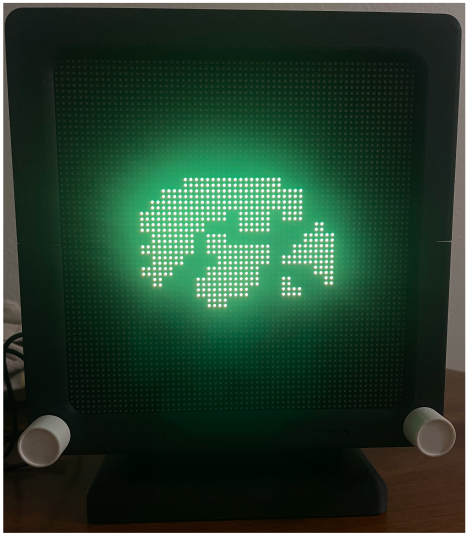
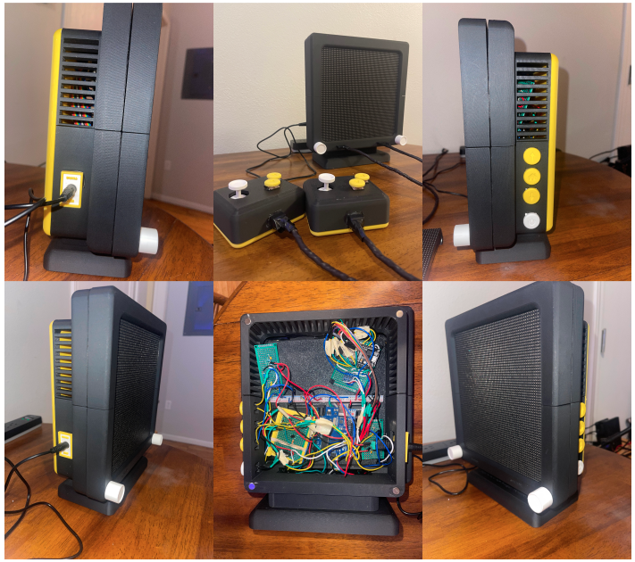
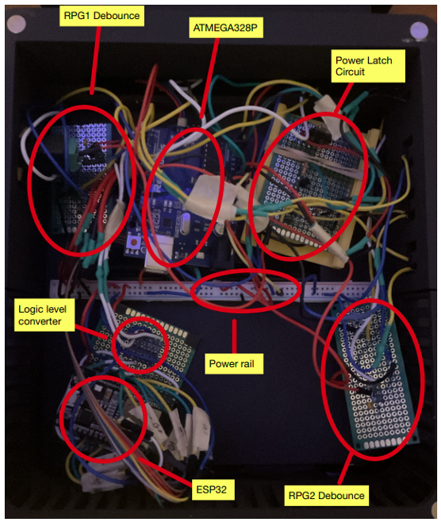
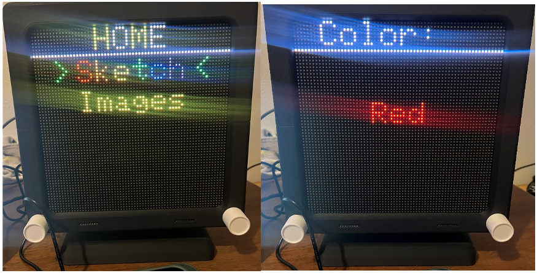
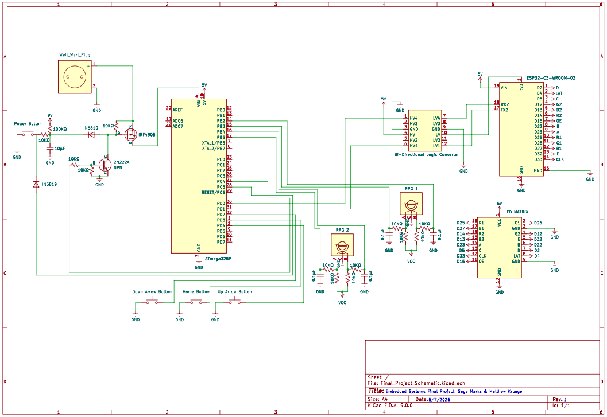

# Final Project - Embedded Systems

  

It looks better in person 

This project showcases our learning from the Embedded Systems course in which we decided to build a game system. The system includes two microcontrollers communicating using UART:
1. Esp32 - required to address all ~4000 addresses of the LED Matrix (64^2)
2. Arduino Uno R3 - handle user interaction with the system

Our project goal was to build something that wont be thrown away - or stripped down to preserve parts - after the class ends. The LED Matrix (and game system) sufficed; it allows for various programs, unique displays, and extendability beyond this course. Because of the ESP32, this system can be iterated on to support user I/O via a web application. However, that would be more of an IoT project than Embedded Systems... just our thinking. As we are roomates, this system is currently being held in our living room. The Hawkeye themed system compliments the room nicely haha.

Currently programmed is 'EtchASketch' and a Pixel Art image viewer. The 'EtchASketch' program is controlled by two dials attached to the front of the system. This works identically to the original game and extends it further with the RGB capability of the LED Matrix. To navigate colors, the user can press buttons on the side of the system (similar to a tv) to select wanted color.
The Pixel Art image has meticulously drawn pixel art images which can be cycled through using the navigation controls on the side of the system.

To navigate between programs, the home button (has home icon) can be clicked to bring up a navigation screen. 

To power off the system, the power button is held for 5 seconds. After which a simple click will return power to the system.

Overall, our project was - and is - predicated on simplicity and ease of use. As any good hardware and software, the design is built to last. The design is fun and accessible to all, which is a success in our books.

## Final Product

  

  

  

  

## Schematic

  

## Demo Video
[Download Project Demo Video](project_report/project_video.MOV)

## Parts List
THIS IS NOT AN EXHAUSTIVE LIST OF PARTS REQUIRED
Note this list does not include the cost of wires, adaptors, psu, etc. this is negligible and already on hand.
There are also various electrical components that were provided by the University of Iowa.

Here are the most relevant parts and their purpose, quantity, and cost
| Part | Description | Quantity | Unit Cost |
|------|-------------|----------|------------|
| ESP32 DevKitV1| Microcontroller to interface LED Matrix | 1 | $5 (off-brand)|
| 64x64 RGB LED Matrix Panel | LED Matrix for display| 1 | $29.99 (off-brand)|
| Arduino Uno | Microcontroller to handle user input | 1 | $0 (provided)
| 3D printed parts | Iowa themed, 3d enclosures | many | ~$12
| magnets | easy access to inside of enclosures | many | ~$5

Total sums to around ~$50+

## 3D Models
All parts were designed inside of Fusion360 and printed using a BambuLab P1S 3D-printer
[3D Models & Cost Breakdown](./3d_models/README.md)

  

## Source Code
* [ATMega328P Source Code](./src/ATMega328P/README.md)
* [ESP32 Source Code](./src/ESP32/README.md)

## Authors

  

    
    

      Sage Marks
    

    

      <a href="mailto:sage-marks@uiowa.edu">Email</a> | <a href="https://www.linkedin.com/in/sage-marks-71a044293/">LinkedIn</a>
    

  

  

    
    

      Matt Krueger
    

    

      <a href="mailto:matthew-krueger@uiowa.edu">Email</a> | <a href="https://www.linkedin.com/in/mattnkrueger/">LinkedIn</a>
    

  

              