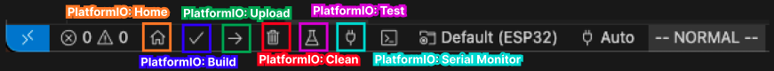

# ESP32 Firmware for Embedded Etch-A-Sketch

## Overview
This firmware powers the display component of the Embedded Etch-A-Sketch system. It receives commands via UART from the ATMega328P controller and displays interactive applications on an LED matrix. The ESP32 processes user input commands and manages the state machine for different applications.

## Hardware Components
- **ESP32 DOIT DEVKIT V1**: Main controller for the display system
- **64x64 RGB LED Matrix**: Connected via HUB75E interface for display
- **UART Connection**: Interface with ATMega328P for receiving user input

## Communication
The ESP32 communicates with the ATMega328P via UART at 115200 baud using Serial2 (pins 16 & 17).

## Key Features
- State machine architecture with multiple application screens
- Color selection interface with various preset colors
- Etch-A-Sketch drawing program with precise pixel control
- Pixel art viewer with navigation between images
- Home screen with menu navigation

## Command Protocol
The ESP32 receives the following commands from the ATMega328P:
- `btnUpArrow` / `btnDownArrow`: Navigate menus or change colors
- `btnHomeClick`: Select menu items
- `btnHomeHold`: Return to previous screen
- `rpg1CW` / `rpg1CCW`: Control X-axis movement in Etch-A-Sketch
- `rpg2CW` / `rpg2CCW`: Control Y-axis movement in Etch-A-Sketch

## Applications
- **Etch-A-Sketch**: Interactive drawing application that allows users to draw with different colors using the rotary encoders
- **Pixel Art**: Displays a slideshow of pixel art images with navigation controls

## Matrix Configuration
The firmware is configured for a 64x64 RGB LED matrix using the HUB75 interface with the following pinout:
```
             +----------+-----------+
row 1:       | R1 (25)  | G1  (26)  |
             +----------+-----------+
row 2:       | B1 (27)  | GND (gnd) |
             +----------+-----------+
row 3:       | R2 (14)  | G2  (12)  |
             +----------+-----------+
row 4:       | B2 (13)  | E   (32)  |
             +----------+-----------+
row 5:       | A (23)   | B   (22)  |
             +----------+-----------+
row 6:       | C (05)   | D   (02)  |
             +----------+-----------+
row 7:       | CLK (33) | LAT (04)  |
             +----------+-----------+
row 8        | OE (15)  | GND (gnd) |
             +----------+-----------+
```

## PlatformIO Configuration
This is a PlatformIO project. The configuration file (`platformio.ini`) contains:

```
; PlatformIO Project Configuration File
;
;   Build options: build flags, source filter
;   Upload options: custom upload port, speed and extra flags
;   Library options: dependencies, extra library storages
;   Advanced options: extra scripting
;
; Please visit documentation for the other options and examples
; https://docs.platformio.org/page/projectconf.html

[env:esp32doit-devkit-v1]
platform = espressif32
board = esp32doit-devkit-v1
framework = arduino
lib_deps =
    fastled/FastLED
    Wire
    adafruit/Adafruit GFX Library
    https://github.com/mrfaptastic/ESP32-HUB75-MatrixPanel-I2S-DMA.git

build_flags =
    -DUSE_GFX_ROOT

upload_speed = 460800           
monitor_speed = 115200
monitor_filters = esp32_exception_decoder
```

## How to Run
1. Install [PlatformIO](https://platformio.org/) (available as extension for VS Code or standalone CLI)
2. Open the project folder
3. Build the project with `platformio run`
4. Upload to your ESP32 with `platformio run --target upload`
5. Monitor serial output with `platformio device monitor`

Alternatively, you can use the PlatformIO interface within VS Code:

<p align="center">
  
</p>

## Documentation

To view the [Doxygen](https://doxygen.nl/) generated documentation:

### Windows
1. Navigate to the `doxygenDocs/html` folder
2. Double-click `index.html` to open in your default web browser

### Mac
1. Navigate to the `doxygenDocs/html` folder
2. Double-click `index.html` to open in your default web browser
   ```bash
   open doxygenDocs/html/index.html
   ```

## Authors  

<div style="display: flex; justify-content: center; gap: 60px;">
  <div align="center">
    
    <div style="display: flex; align-items: center; justify-content: center;">
      Sage Marks
    </div>
    <div>
      <a href="mailto:sage-marks@uiowa.edu">Email</a> | <a href="https://www.linkedin.com/in/sage-marks-71a044293/">LinkedIn</a>
    </div>
  </div>

  <div align="center">
    
    <div style="display: flex; align-items: center; justify-content: center;">
      Matt Krueger
    </div>
    <div>
      <a href="mailto:matthew-krueger@uiowa.edu">Email</a> | <a href="https://www.linkedin.com/in/mattnkrueger/">LinkedIn</a>
    </div>
  </div>
</div>              
    